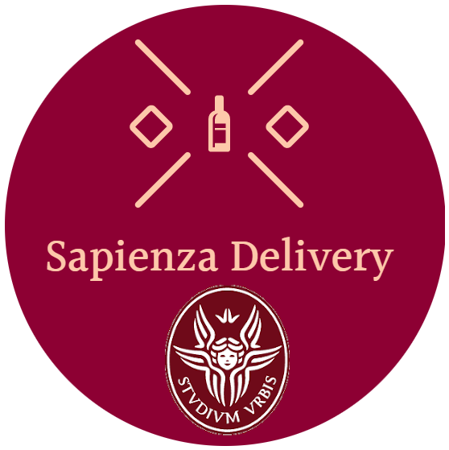

## Food-Delivery-System with WebRatio

This project was carried out for the Advanced Software Engineering exam, Master degree in Computer Science at Sapienza - September 2022




With the advent of digital transformation, a low-code development platform that anyone can use to rapidly develop new ones is an essential tool for enabling your business to adapt and thrive.
Low-code development platforms make companies more productive and flexible by offering: efficiency, flexibility, responsiveness, iterability.
We used the <a href="https://www.webratio.com/site/content/it/home">Webratio</a> low-code platform.
<br>
<p align="center">
<strong>Templates included:</strong>
<a href="/.github/README.md">README</a> • <a href="/.github/CONTRIBUTING.md">CONTRIBUTING </a> • <a href="/.github/PULL_REQUEST_TEMPLATE.md">PULL REQUEST</a> • <a href="/.github/ISSUE_TEMPLATE.md">ISSUE TEMPLATE</a> • <a href="/.github/CONTRIBUTORS.md">CONTRIBUTORS</a>
</p>
<br>


## Getting Started

### Dependencies

* Describe any prerequisites, libraries, OS version, etc., needed before installing program.
* ex. Windows 10

### Installing

* How/where to download your program
* Any modifications needed to be made to files/folders

### Executing program

* How to run the program
* Step-by-step bullets
```
code blocks for commands
```

## Help

Any advise for common problems or issues.
```
command to run if program contains helper info
```

## Authors :thumbsup:

> Those who participated in the creation of the project are listed here

* [Alberto Cotumaccio](https://it.linkedin.com/in/alberto-cotumaccio-8b8443229?trk=people-guest_people_search-card)
* Giovanni Montobbio
* Vincenzo Romito

## Version History

* 0.2
    * Various bug fixes and optimizations
    * See [commit change]() or See [release history]()
* 0.1
    * Initial Release

## License

This project is licensed under the [NAME HERE] License - see the LICENSE.md file for details

## Acknowledgments

Inspiration, code snippets, etc.
* [awesome-readme](https://github.com/matiassingers/awesome-readme)
* [PurpleBooth](https://gist.github.com/PurpleBooth/109311bb0361f32d87a2)
* [dbader](https://github.com/dbader/readme-template)
* [zenorocha](https://gist.github.com/zenorocha/4526327)
* [fvcproductions](https://gist.github.com/fvcproductions/1bfc2d4aecb01a834b46)
